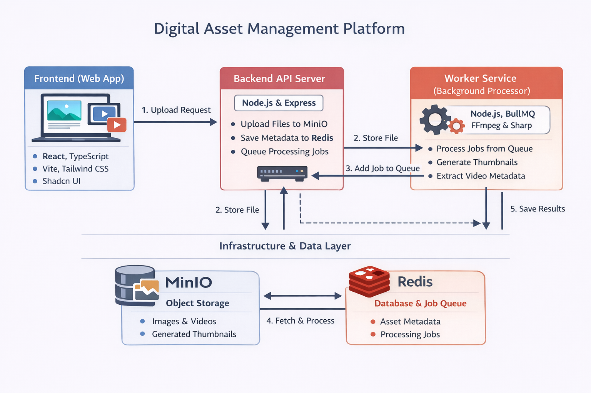
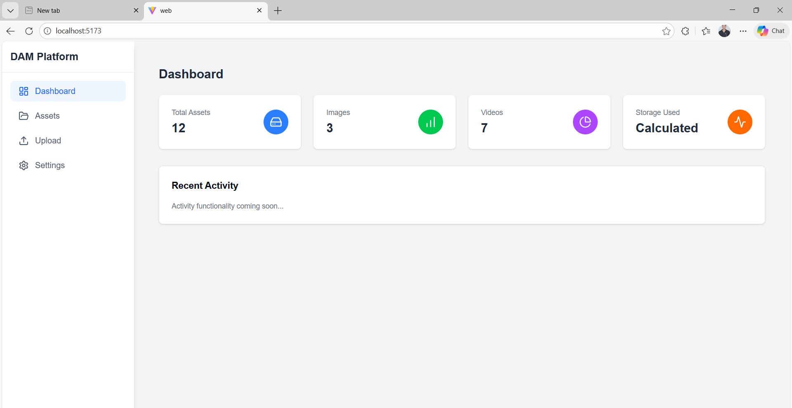
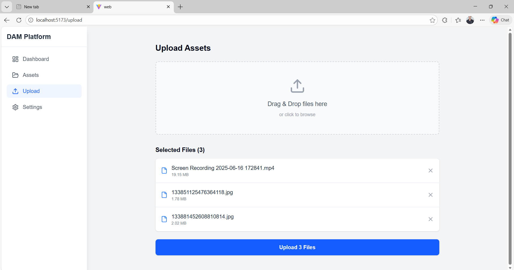
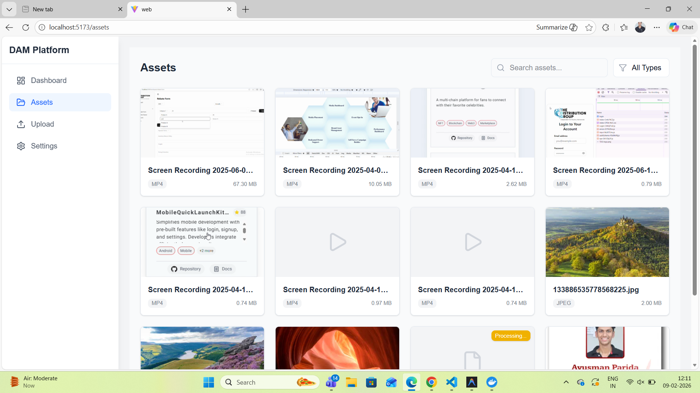

# Digital Asset Management (DAM) Platform

A scalable, microservices-based Digital Asset Management platform for uploading, processing, organizing, and retrieving images and videos.  
The system is designed to keep the API responsive by offloading heavy processing tasks to background workers.

---

## 🏗️ System Architecture

### High-Level Architecture Diagram



> High-level overview of the Digital Asset Management platform

---

## 🔁 Data Flow Overview

1. User uploads a file from the **Frontend Web App**
2. The **Backend API Server**:
   - Streams the file directly to **MinIO**
   - Stores asset metadata in **Redis**
   - Pushes a processing job to the **Redis queue**
3. The **Worker Service**:
   - Pulls jobs from Redis (BullMQ)
   - Downloads original files from MinIO
   - Generates thumbnails or extracts video metadata
   - Uploads processed files back to MinIO
   - Updates asset status in Redis
4. The frontend fetches updated status from the API and displays the processed asset

---

## 🧩 Architecture Components

### Frontend (Web App)
**Tech Stack**
- React
- TypeScript
- Vite
- Tailwind CSS
- Shadcn UI

**Responsibilities**
- File uploads
- Asset gallery & previews
- Display processing status

---

### Backend API Server
**Tech Stack**
- Node.js
- Express

**Responsibilities**
- Handle HTTP requests
- Stream uploads to MinIO
- Store asset metadata in Redis
- Dispatch background jobs

---

### Worker Service (Background Processor)
**Tech Stack**
- Node.js
- BullMQ
- FFmpeg
- Sharp

**Responsibilities**
- Consume jobs from Redis
- Generate image thumbnails
- Extract video metadata and screenshots
- Upload processed outputs to MinIO
- Update job and asset status

---

### Infrastructure & Data Layer

#### MinIO (Object Storage)
- Stores original images and videos
- Stores generated thumbnails and derived assets
- S3-compatible storage

#### Redis (Database & Queue)
- Primary metadata store for assets
- Message broker for background jobs (BullMQ)

---

## 🖥️ User Interface Screenshots

### Dashboard



- Asset listing with processing status
- Quick preview of images and videos

---

### Upload Flow



- Drag-and-drop file upload
- Immediate feedback on upload progress

---

### Asset Details



- Metadata view
- Thumbnail preview
- Processing status

---

## 🎯 Key Design Decisions

- **Asynchronous processing** to keep API fast
- **Streaming uploads** to avoid memory pressure
- **Clear separation** between API and worker services
- **Object storage-first** design for large media files
- **Redis-backed queue** for reliable job handling

---

## 🚀 Future Enhancements

- Authentication & role-based access
- Search and filtering
- Asset versioning
- CDN integration
- Horizontal worker scaling

---

## 🛠 Prerequisites

- **Node.js**: v20 or higher
- **Docker & Docker Compose**: For running infrastructure services.
- **FFmpeg**: Required on the host machine if running the backend *outside* of Docker.

## 🏁 Quick Start

### 1. Start Infrastructure
Run Redis and MinIO:
```bash
cd api/infra
docker-compose up -d
```
- MinIO Console: http://localhost:9001 (User/Pass: `minioadmin` / `minioadmin`)
- Redis: `localhost:6379`

### 2. Start Backend API & Worker
The backend handles API requests and background processing.

```bash
cd api
npm install
npm run dev      # Starts API Server on port 4000
```

Open a **new terminal** for the worker (required for thumbnails):
```bash
cd api
npm run worker   # Starts Background Worker
```

### 3. Start Frontend
```bash
cd web
npm install
npm run dev
```
Access the app at `http://localhost:5173`.

## 📦 Deployment

The platform is designed to run on Docker Swarm.

```bash
# In api/ directory
npm run docker:build
npm run docker:push
npm run swarm:deploy
```

See `api/infra/swarm.yml` for stack configuration.

## 📄 Documentation

- [Frontend README](./web/README.md)
- [Backend README](./api/README.md)
